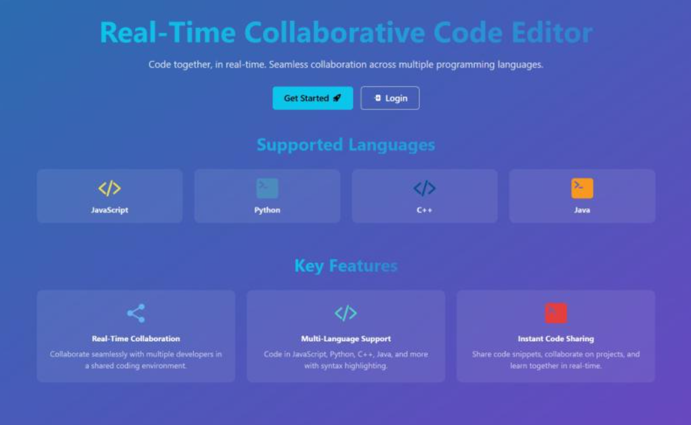
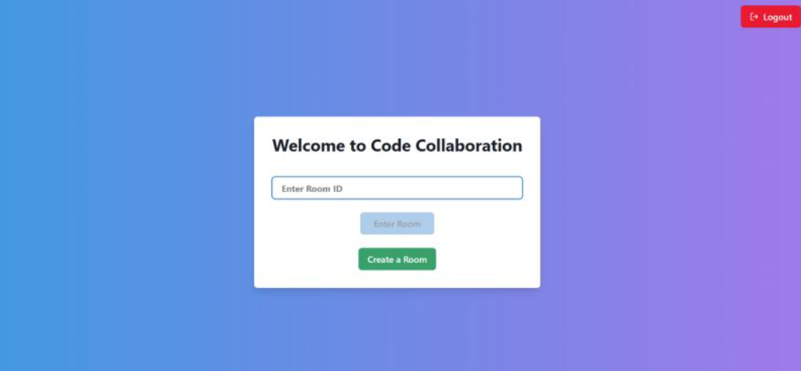
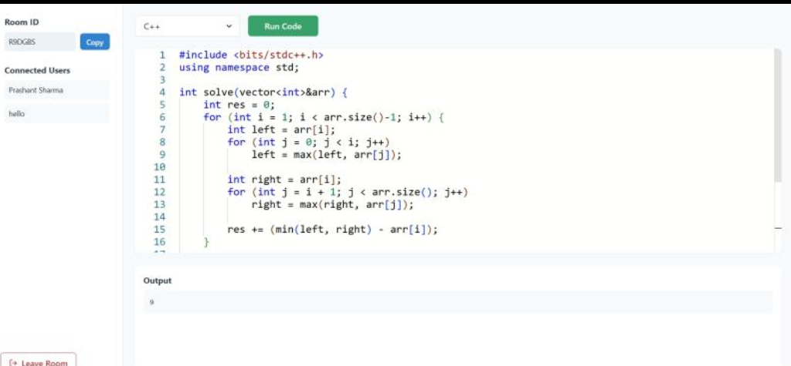
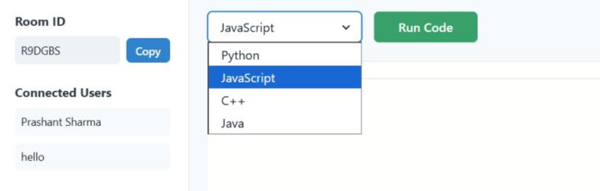
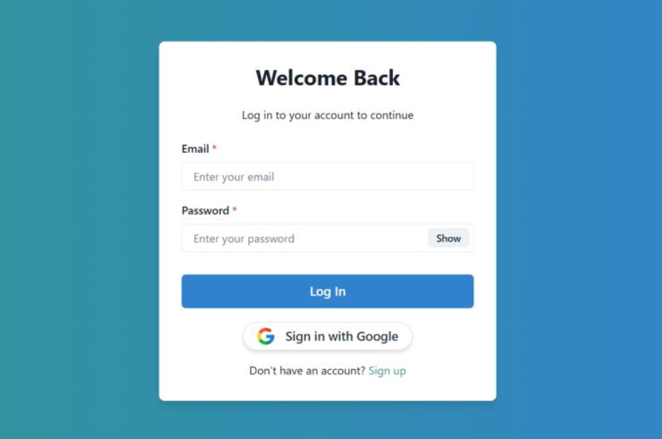

# RealTCe - Real-Time Code Execution Platform

RealTCe is a robust web application designed to provide a secure and interactive environment for running code in real-time. Built with a specialized Docker infrastructure, it allows users to execute code safely in isolated containers, supporting real-time collaboration and room management.

## 🚀 Features

* **Secure Code Execution:** Utilizes Docker containers to execute user code in an isolated sandbox environment, preventing malicious attacks.
* **Real-Time Rooms:** Create and join unique rooms for coding sessions.
* **Language Support:** Supports execution for multiple languages (Javascript, Python, C++, Java).
* **Authentication:** Secure user authentication using JWT and Google OAuth (Passport.js).
* **Live Output:** Instant feedback and output generation from the server.

## 📸 Screenshots

### 1. Landing Page
A clean interface welcoming users to the platform.


### 2. The Coding Arena (Room)
The core workspace where users write and execute code.


### 3. Secure Execution in Action
Showing the output terminal responding to user logic.


### 4. Multi-Language Support
Easily switch between different programming languages (Python, C++, Java, etc.) using the dropdown menu.


### 5. Authentication
Secure login and signup flow.


## 🛠️ Tech Stack

**Frontend:**
* **React.js (Vite):** Fast and responsive UI.
* **Tailwind CSS:** Modern styling.
* **Axios:** For API communication.

**Backend:**
* **Node.js & Express.js:** Server-side logic.
* **MongoDB (Mongoose):** Database for users and session data.
* **Passport.js:** Authentication strategies (Local & Google).

**Infrastructure:**
* **Docker:** Containerization for isolated code execution.
* **Docker Compose:** Orchestration of the full-stack environment.

## ⚙️ Installation & Setup

Follow these steps to run the project locally.

### Prerequisites
* Node.js (v14+)
* Docker Desktop (Must be running for code execution to work)
* MongoDB

### 1. Clone the Repository
```bash
git clone [https://github.com/prashthegeek/realtce.git](https://github.com/prashthegeek/realtce.git)
cd realtce